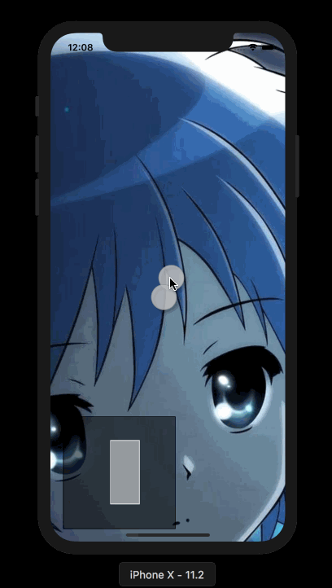

# ScrollViewThumbnail

Quickly create thumbnails for zoomed views in UIScrollview with just a single line of code.

[](https://travis-ci.org/TBXark/ScrollViewThumbnail)
[](http://cocoapods.org/pods/ScrollViewThumbnail)
[](http://cocoapods.org/pods/ScrollViewThumbnail)
[](http://cocoapods.org/pods/ScrollViewThumbnail)





## Example

To run the example project, clone the repo, and run `pod install` from the Example directory first.


```swift
class ViewController: UIViewController, UIScrollViewDelegate {

    let scrollview: UIScrollView = {
        let sv = UIScrollView()
        sv.minimumZoomScale = 0.5
        sv.maximumZoomScale = 20
        sv.contentSize = CGSize(width: UIScreen.main.bounds.width * 2, height: UIScreen.main.bounds.height * 2)
        sv.frame = UIScreen.main.bounds
        return sv
    }()

    let control: UIImageView = {
       let v = UIImageView(image: UIImage(named: "avatar"))
        v.frame = CGRect(x: 0,
                         y: (UIScreen.main.bounds.height - UIScreen.main.bounds.width)/2,
                         width: UIScreen.main.bounds.width,
                         height: UIScreen.main.bounds.width)
        return v
    }()
    let svt = ScrollViewThumbnailView(frame: CGRect(x: 0, y: UIScreen.main.bounds.height - 200, width: 200, height: 200))
    
    override func viewDidLoad() {
        super.viewDidLoad()
        automaticallyAdjustsScrollViewInsets = false
        scrollview.delegate = self
        
        view.addSubview(scrollview)
        view.addSubview(svt)
        scrollview.addSubview(control)

        // Just bind scrollview for  ScrollViewThumbnailView here.
        svt.bindScrollView(scrollview)
    }

    override func didReceiveMemoryWarning() {
        super.didReceiveMemoryWarning()
    }
    
    func viewForZooming(in scrollView: UIScrollView) -> UIView? {
        return control
    }
}

```

## Requirements

iOS 8+, Swift 4, Xcode 9

## Installation

ScrollViewThumbnail is available through [CocoaPods](http://cocoapods.org). To install
it, simply add the following line to your Podfile:

```ruby
pod 'ScrollViewThumbnail'
```

## Author

TBXark, tbxark@outlook.com

## License

ScrollViewThumbnail is available under the MIT license. See the LICENSE file for more info.
